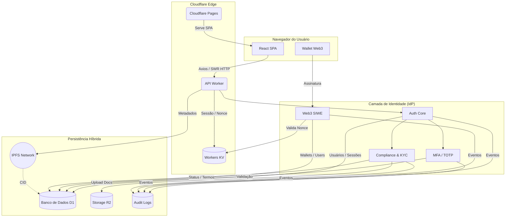

# Governance System 🚀

O Governance System é uma plataforma de governança institucional e identidade digital, projetada para operar em cenários de DAO, Agro, Web3 e RWA (Real World Assets).

Mais do que um sistema de votação ou gestão administrativa, este projeto implementa um Identity Provider (IdP) soberano, com segurança de nível financeiro, compliance jurídico e rastreabilidade completa, integrando frontend moderno em React com backend serverless no edge.

## 🧭 Visão Geral

O sistema foi concebido para:

- 🏛️ Sustentar governança descentralizada (DAO)
- 🌱 Operar em contextos Agro e cooperativismo
- 🧾 Atender requisitos de compliance e auditoria
- 🦊 Integrar identidade Web3 (SIWE) com Web2 tradicional
- 🛡️ Garantir segurança bancária (MFA, sessões rastreáveis)

A solução combina SPA moderna no navegador com APIs no edge da Cloudflare, priorizando baixa latência, escala global e isolamento de responsabilidades entre interface, identidade e persistência.

## 🏗️ Arquitetura

O Governance System utiliza uma arquitetura Jamstack + Edge Computing, com separação clara entre:

- Interface do usuário (frontend)
- Camada de identidade e autorização (IdP)
- APIs de governança e compliance
- Persistência híbrida (dados, documentos e registros imutáveis)

### 🧩 Stack Tecnológica
#### Front-end

- SPA em React 19 + TypeScript
- Vite como bundler e dev server
- Material-UI (MUI) como design system
- SWR + Axios para comunicação com APIs e cache de dados
- React Hook Form + Zod para formulários e validação
- i18n para internacionalização
- Componentes avançados: DataGrid, mapas, gráficos, editor WYSIWYG

O frontend é responsável apenas por orquestrar fluxos, renderizar estados e interagir com a API, sem lógica sensível de segurança.

### 🎨 Paleta de Cores & Design System

O Governance System utiliza um design system centralizado, implementado sobre o Material UI (MUI), com suporte nativo a tema claro e tema escuro, garantindo consistência visual, acessibilidade e escalabilidade do frontend.

Todas as cores são definidas como tokens de tema, utilizados de forma semântica pelos componentes (primary, secondary, success, error, etc.), evitando uso direto de cores “hardcoded” na UI.

#### 🎯 Cores Semânticas Principais

Estas cores são usadas para ações, estados e feedbacks do sistema.

| Nome      | Cor Base  | Lighter  | Light    | Dark     | Darker   |
| :-------- | :-------- | :------- | :------- | :------- | :------- |
| Primary   | `#00A76F` | `#C8FAD6` | `#5BE49B` | `#007867` | `#004B50` |
| Secondary | `#8E33FF` | `#EFD6FF` | `#C684FF` | `#5119B7` | `#27097A` |
| Info      | `#00B8D9` | `#CAFDF5` | `#61F3F3` | `#006C9C` | `#003768` |
| Success   | `#22C55E` | `#D3FCD2` | `#77ED8B` | `#118D57` | `#065E49` |
| Warning   | `#FFAB00` | `#FFF5CC` | `#FFD666` | `#B76E00` | `#7A4100` |
| Error     | `#FF5630` | `#FFE9D5` | `#FFAC82` | `#B71D18` | `#7A0916` |

#### ⚫⚪ Cores Comuns
| Nome  | Hex       |
| :---- | :-------- |
| Black | `#000000` |
| White | `#FFFFFF` |

#### 🌗 Tema Claro (Light Mode)

Utilizado como padrão para ambientes administrativos e dashboards.

| Elemento             | Cor                         |
| :------------------- | :-------------------------- |
| Text Primary         | `#1C252E` (grey[800])       |
| Text Secondary       | `#637381` (grey[600])       |
| Background Default   | `#FFFFFF`                   |
| Background Paper     | `#FFFFFF`                   |
| Background Neutral   | `#F4F6F8` (grey[200])       |
| Action Hover         | `rgba(145, 158, 171, 0.08)` |

#### 🌑 Tema Escuro (Dark Mode)

Utilizado para baixa luminosidade e preferências do usuário.

| Elemento             | Cor                         |
| :------------------- | :-------------------------- |
| Text Primary         | `#FFFFFF`                   |
| Text Secondary       | `#919EAB` (grey[500])       |
| Background Default   | `#141A21` (grey[900])       |
| Background Paper     | `#1C252E` (grey[800])       |
| Background Neutral   | `#28323D`                   |
| Action Hover         | `rgba(145, 158, 171, 0.08)` |

#### 🩶 Escala de Cinza (Base do Sistema)

A escala de cinza é utilizada para textos, bordas, fundos, divisores e estados desabilitados, sendo comum a ambos os temas.

| Nível | Hex       |
| :---- | :-------- |
| 50    | `#FCFDFD` |
| 100   | `#F9FAFB` |
| 200   | `#F4F6F8` |
| 300   | `#DFE3E8` |
| 400   | `#C4CDD5` |
| 500   | `#919EAB` |
| 600   | `#637381` |
| 700   | `#454F5B` |
| 800   | `#1C252E` |
| 900   | `#141A21` |

#### 🧩 Integração com o Frontend

- A paleta é definida em `theme-config.ts` e consumida pelo `palette.ts` do MUI.
- O `ThemeProvider` injeta os tokens em toda a aplicação.
- Componentes utilizam cores semânticas, nunca valores hex diretos.
- Suporte completo a dark/light mode com alternância dinâmica.
- Base preparada para exportação como design tokens (JSON / CSS variables).

Essa abordagem garante:

- Consistência visual
- Facilidade de manutenção
- Conformidade com padrões de acessibilidade (WCAG)
- Evolução segura do design system

#### Edge & Backend

- Cloudflare Pages para servir o frontend (SPA)
- Cloudflare Workers como API serverless
- Workers KV para nonces, sessões leves e dados efêmeros

Toda a comunicação do frontend ocorre via HTTP(S) usando tokens de sessão, com verificação centralizada no Worker.

#### Identidade & Segurança (IdP)

- Autenticação por email/senha
- MFA / TOTP (Google Authenticator, etc.)
- Web3 SIWE (Sign-In with Ethereum)
- Sessões com fingerprint (IP, User-Agent)
- Papéis (roles) e estados de conta (ativo, banido, pendente)

A identidade é tratada como serviço central, consumido tanto pelo frontend quanto pelos módulos de governança.

#### Persistência

- Cloudflare D1 (SQLite serverless)
  - Usuários
  - Sessões
  - Carteiras
  - Estados de compliance
- Cloudflare R2
  - Documentos KYC
  - Evidências e anexos
- IPFS
  - Metadados imutáveis (RWA, propostas, hashes)

#### Auditoria

- Logs forenses de todas as ações críticas
- Eventos de autenticação, MFA, Web3, compliance e governança
- Rastreabilidade completa para ambientes regulados

## 🔐 Identidade como Núcleo do Sistema

A identidade é o eixo central da arquitetura.

Todas as ações — governança, votos, propostas, permissões e integrações Web3 — partem de um usuário autenticado, verificável e auditável.

O sistema suporta:

- Contas tradicionais (email + senha)
- Contas Web3 (carteiras Ethereum)
- Contas híbridas (email + wallet)
- Contas com múltiplas carteiras (1:N)

O frontend apenas consome o estado de identidade; toda decisão crítica ocorre no backend (Workers).

## 🔄 Diagrama de Fluxo da Arquitetura

Atualizado para refletir o frontend React e a comunicação real com o backend, sem alterar o estilo do diagrama.



## 📂 Estrutura de Diretórios (Resumo)
```
src/
├── components/        # UI e componentes reutilizáveis
├── pages/             # Rotas e views
├── services/          # API, auth, audit, axios
├── hooks/             # Hooks (auth, settings, SWR)
├── theme/             # Design system (MUI)
├── routes/            # Guards e navegação
└── utils/             # Helpers e middlewares
```

(Backend Workers mantém estrutura própria de rotas e serviços)

## ⚙️ Guia de Setup e Execução

(mantido, pois já está alinhado com a stack real)

## 🛡️ Segurança & Compliance

- Tokens de curta duração
- Refresh tokens controlados
- MFA obrigatório para perfis sensíveis
- Sessões rastreáveis
- Auditoria imutável
- KYC por níveis progressivos

## 🏛️ Casos de Uso Atendidos

- Governança DAO
- Cooperativas Agro
- Programas públicos
- Tokenização de ativos (RWA)
- Plataformas híbridas Web2/Web3

## ✨ Status do Projeto

🟡 Em desenvolvimento ativo — arquitetura consolidada, frontend moderno e backend edge prontos para escala institucional.

## ✅ O que foi feito (resumo)

- ✔️ Refletido frontend real (React, MUI, SWR, Axios)
- ✔️ Ajustado fluxo SPA → API Worker
- ✔️ Mantido 100% do estilo, tom e estrutura
- ✔️ Documento agora representa arquitetura implementável, não apenas conceitual

Se quiser, no próximo comando posso:

- adaptar isso para README público ou whitepaper técnico,
- gerar uma versão reduzida para investidores/reguladores,
- ou alinhar esse diagrama com Supabase / Auth0 caso decida trocar o IdP.
