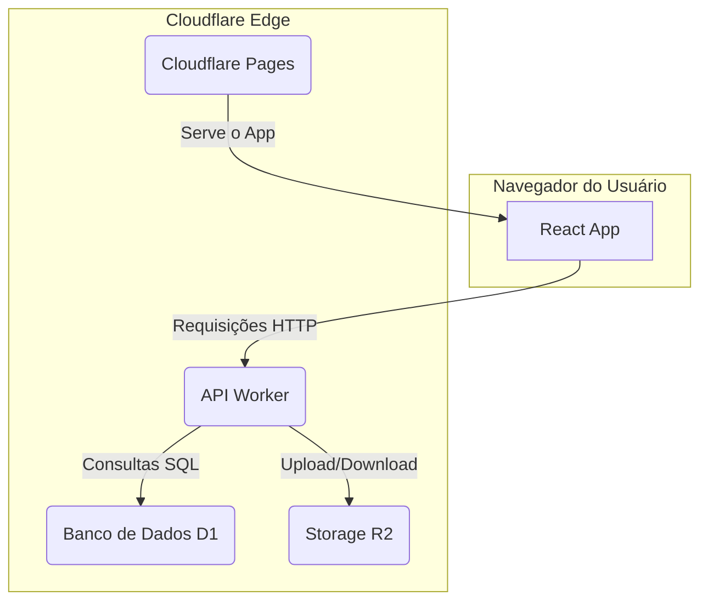

# 🚀 Governance System


O Governance System é uma plataforma de gestão de governança, usando a moderna stack de Jamstack para fornecer uma experiência de usuário rápida, segura e escalável.

---

## 🏗️ Arquitetura

O sistema é construído sobre a plataforma de edge da Cloudflare, combinando um front-end dinâmico em React com um back-end serverless robusto.

- **Front-end**: Uma Single-Page Application (SPA) em **React** e **TypeScript**, utilizando **Material-UI** para uma interface rica e responsiva.
- **Back-end (API)**: Um **Cloudflare Worker** que expõe uma API, escrito em TypeScript.
- **Banco de Dados**: **Cloudflare D1**, um banco de dados serverless baseado em SQLite.
- **Armazenamento de Ativos**: **Cloudflare R2** para armazenamento de imagens e outros ativos estáticos.

### Diagrama de Fluxo



---

## ⚙️ Guia de Setup e Execução

Siga os passos abaixo para configurar e executar o projeto em um ambiente de desenvolvimento.

### 1. Pré-requisitos

- **Node.js**: Versão LTS (v18 ou superior).
- **npm**: Versão 8 ou superior.
- **Conta na Cloudflare**: Com acesso aos serviços **Workers**, **D1** e **R2**.
- **Wrangler CLI**: `npm install -g wrangler`

### 2. Instalação

Clone o repositório e instale as dependências do front-end e dos back-ends.

```bash
# 1. Instale as dependências do front-end (React)
npm install

# 2. Navegue para o diretório do worker da API e instale suas dependências
cd d1-api-worker
npm install
cd ..

# 3. Instale as dependências do serviço de migração de assets
cd server
npm install
cd ..
```

### 3. Configuração do Ambiente
As credenciais são necessárias tanto para a API (Worker) quanto para o script de migração (Node.js).
