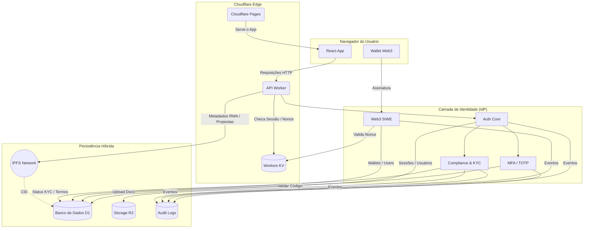

# Governance System 🚀

O Governance System é uma plataforma de governança institucional e identidade digital, projetada para operar em cenários de DAO, Agro, Web3 e RWA (Real World Assets).

Mais do que um sistema de votação ou gestão administrativa, este projeto implementa um Identity Provider (IdP) soberano, com segurança de nível financeiro, compliance jurídico e rastreabilidade completa.

## 🧭 Visão Geral

O sistema foi concebido para:

- 🏛️ Sustentar governança descentralizada (DAO)
- 🌱 Operar em contextos Agro e cooperativismo
- 🧾 Atender requisitos de compliance e auditoria
- 🦊 Integrar identidade Web3 (SIWE) com Web2 tradicional
- 🛡️ Garantir segurança bancária (MFA, sessões rastreáveis)

Toda a arquitetura roda no edge da Cloudflare, priorizando latência mínima, escalabilidade global e simplicidade operacional.

## 🏗️ Arquitetura

O Governance System utiliza uma arquitetura Jamstack + Edge Computing, com separação clara entre interface, identidade, governança e persistência de dados.

### Stack Tecnológica

#### Front-end
- SPA em React + TypeScript
- Material-UI (MUI) para UI responsiva e acessível

#### Edge & Backend
- Cloudflare Pages para servir o front-end
- Cloudflare Workers como API serverless

#### Identidade & Segurança (IdP)
- Autenticação por email/senha
- MFA / TOTP (Google Authenticator, etc.)
- Web3 SIWE (Sign-In with Ethereum)
- Sessões com fingerprint (IP, User-Agent)

#### Persistência
- Cloudflare D1 (SQLite serverless)
- Cloudflare R2 (documentos KYC e ativos)

#### Auditoria
- Logs forenses de todas as ações críticas

## 🔐 Identidade como Núcleo do Sistema

A identidade é o eixo central da arquitetura. Todas as ações — governança, votos, movimentações, permissões — partem de um usuário autenticado, auditável e com nível de verificação conhecido.

O sistema suporta:

- Contas tradicionais (email + senha)
- Contas Web3 (carteiras Ethereum)
- Contas híbridas (email + wallet)
- Contas com múltiplas carteiras (1:N)

## 🔄 Diagrama de Fluxo da Arquitetura


---

## 📂 Estrutura de Diretórios (Resumo)

```
src/
├── db/
│   └── schema.ts            # Users, Sessions, Wallets, Audit Logs
│
├── routes/
│   └── core/
│       └── auth/
│           ├── index.ts     # Login, Refresh, Logout
│           ├── session.ts   # /me, Perfil
│           ├── password.ts  # Recuperação de senha
│           ├── mfa.ts       # MFA / TOTP
│           ├── web3.ts      # SIWE & Wallets
│           ├── compliance.ts# Termos & KYC
│           └── admin.ts     # Roles & Banimento
│
├── services/
│   └── audit.ts             # Logger global de auditoria
│
└── utils/
    └── auth-guard.ts        # Middleware de autenticação
```

## ⚙️ Guia de Setup e Execução

### 1. Pré-requisitos

- Node.js v18 ou superior
- npm v8 ou superior
- Wrangler CLI (Cloudflare)
  ```bash
  npm install -g wrangler
  ```

### 2. Instalação

```bash
npm install
```

### 3. Variáveis de Ambiente

Crie um arquivo `.dev.vars` (não commitado):

```
JWT_SECRET=super_secret_key
REFRESH_TOKEN_SECRET=another_secret
R2_BUCKET_NAME=governance-docs
```

### 4. Desenvolvimento Local

```bash
wrangler dev
```
O front-end será servido via Cloudflare Pages (dev) e a API via Workers.

## 🛡️ Segurança & Compliance

- Tokens JWT de curta duração
- Refresh tokens revogáveis
- MFA obrigatório para admins
- Sessões com fingerprint
- Auditoria forense de eventos
- KYC por níveis (Email → Documento → Aprovado)

## 🏛️ Casos de Uso Atendidos

- Governança DAO
- Cooperativas Agro
- Programas públicos
- Tokenização de ativos (RWA)
- Plataformas híbridas Web2/Web3

## 📜 Licença

Este projeto está sob licença MIT.

## ✨ Status do Projeto

🟡 Em desenvolvimento ativo — arquitetura consolidada e pronta para evolução funcional.

Este repositório implementa um sistema de identidade e governança de nível institucional, preparado para ambientes regulados e descentralizados.
